# Vania Dart backend framework

Evaluasi REST API Menggunakan Framework Vania

<!-- ss_customers -->
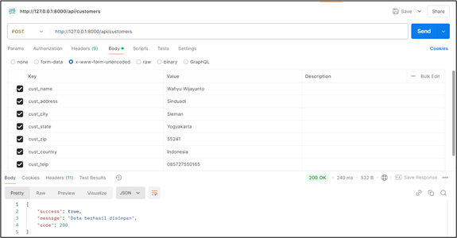
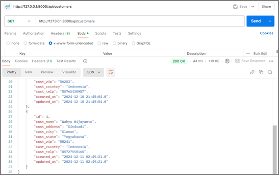
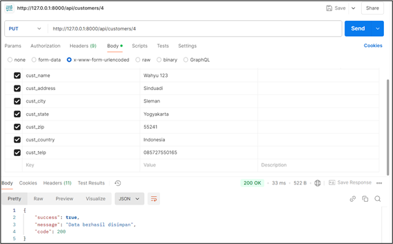
1

<!-- ss_vendors -->
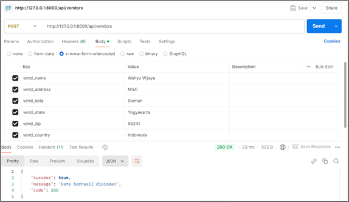
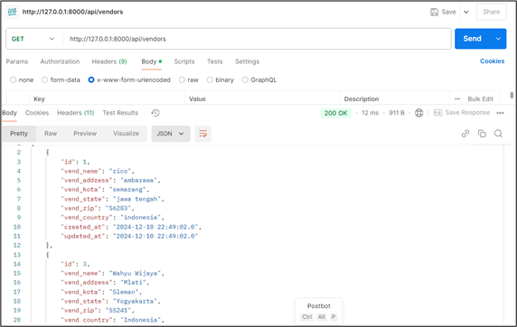
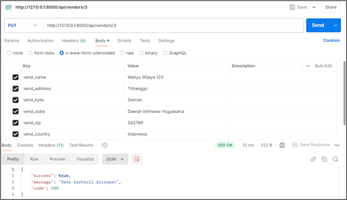
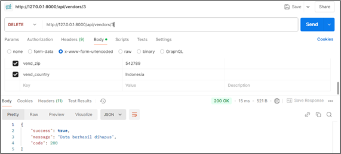

<!-- ss_products -->
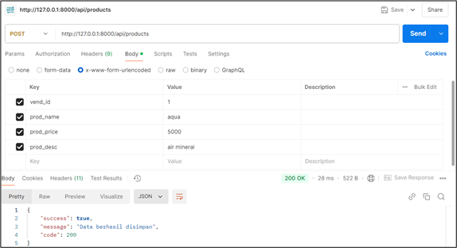
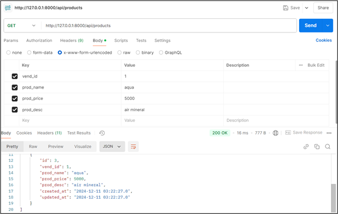
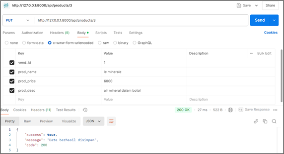

<!-- ss_productNote -->
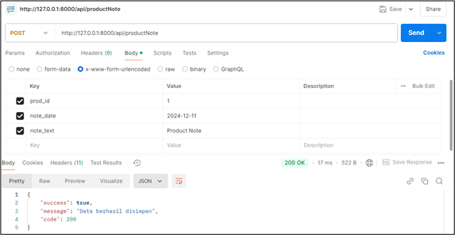
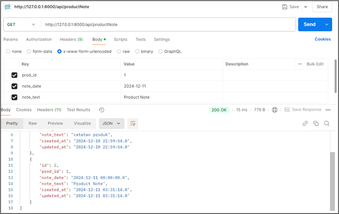
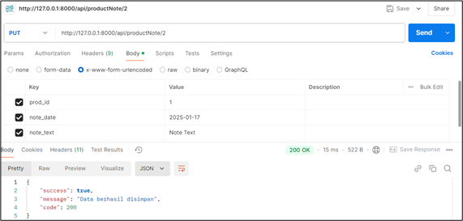
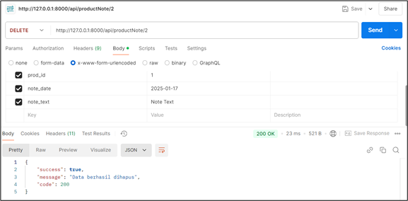

<!-- ss_orders -->
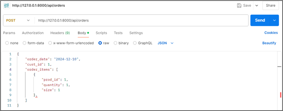

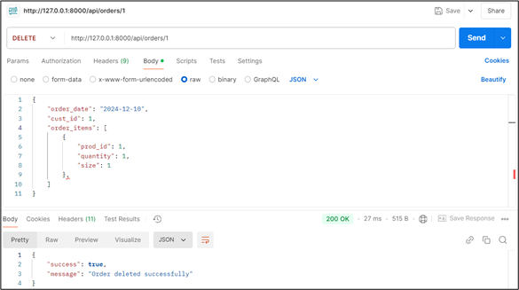

<!-- ss_register -->
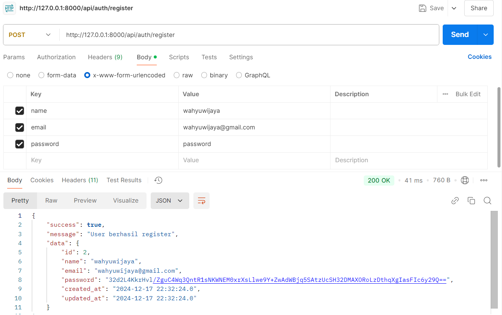

<!-- ss_login -->
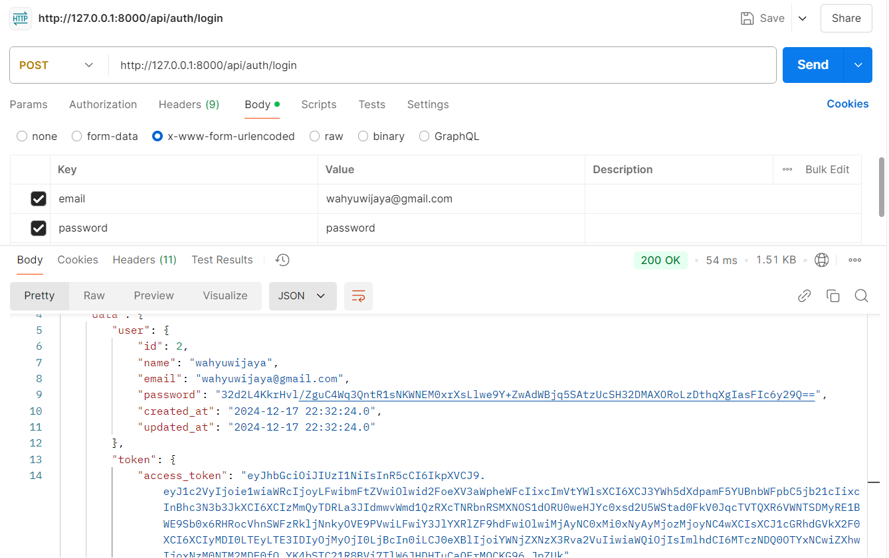

<!-- ss_logout -->
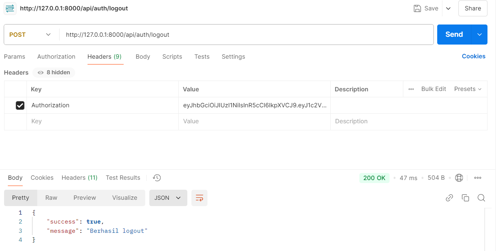

<!-- CONTOH HASIL YANG SUDAH MENGGUNAKAN AUTH (saya mencontohkan pada customers) -->
<!-- ss_customersAuth -->
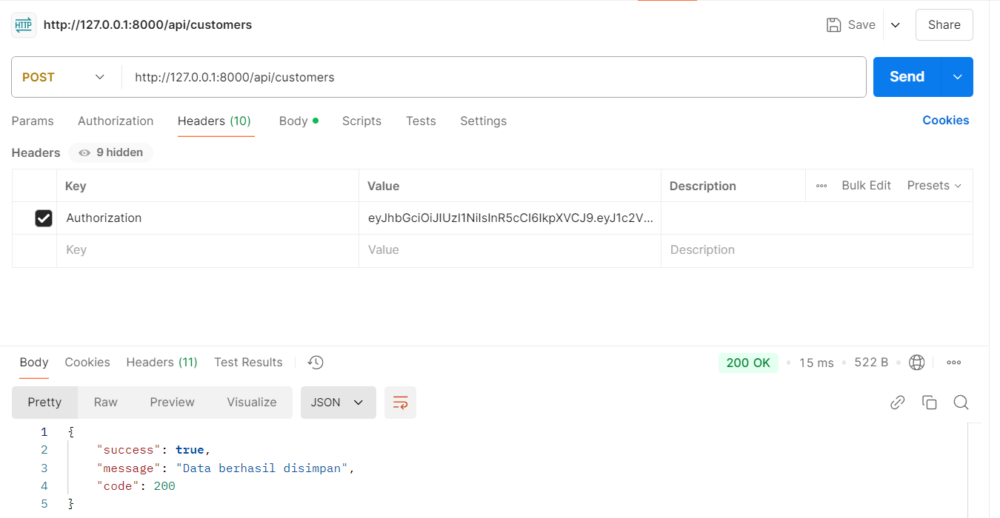
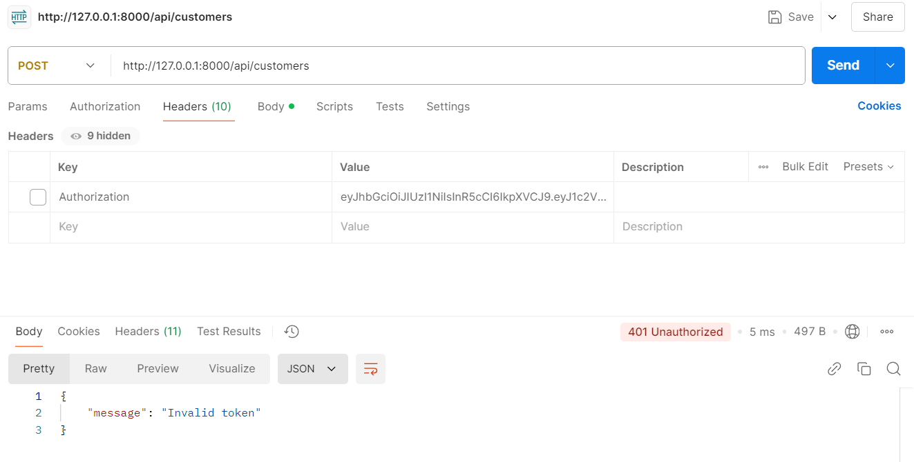